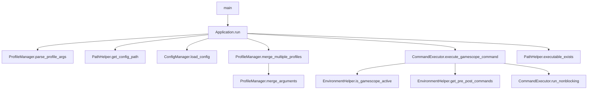
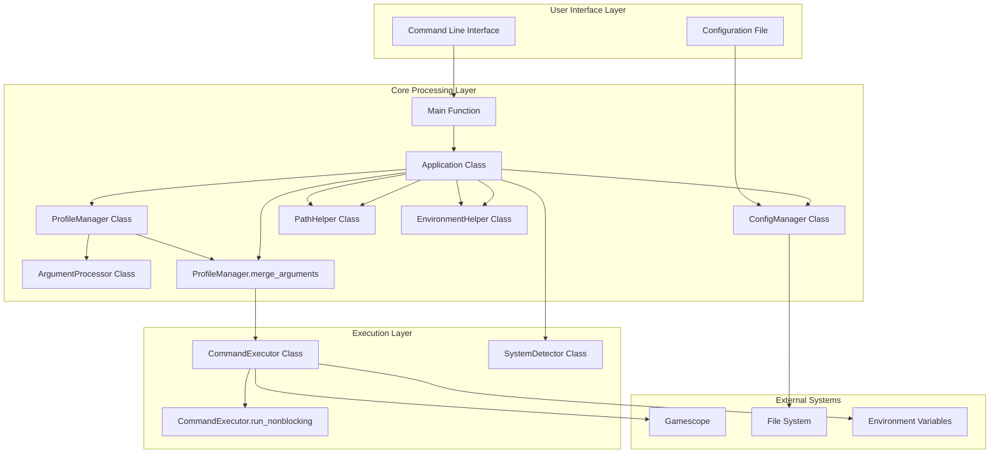
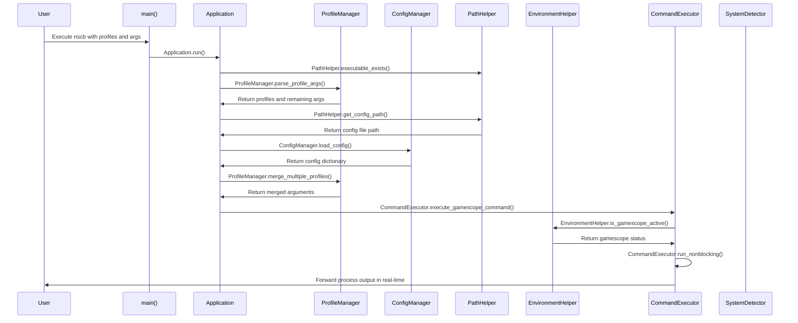

# NeoscopeBuddy (nscb) - Design Specification

## System Overview

NeoscopeBuddy (nscb.py) is a Python-based gamescope wrapper that provides a profile-based configuration system for managing gamescope settings. It enables users to define reusable gamescope configurations in a config file and apply them via command-line arguments with support for overrides.

### Core Purpose

- Provides a convenient wrapper around the gamescope compositor
- Enables profile-based configuration management
- Handles argument merging with precedence rules
- Supports environment hooks for pre/post command execution

## Architecture and Components

### Core Components



#### Main Entry Point (`main`)

- Entry point for the application
- Creates and runs the `Application` instance
- Handles global exception handling and returns appropriate exit codes

#### Application (`Application`)

- Main orchestrator class that manages the entire workflow
- Coordinates all other components
- Handles dependency validation and execution flow

#### Profile Manager (`ProfileManager`)

- `parse_profile_args`: Parses profile specifications (`-p`, `--profile`, `--profiles=...`)
- `merge_arguments`: Merges profile arguments with override arguments, implementing precedence rules
- `merge_multiple_profiles`: Handles merging of multiple profiles using reduce
- `_merge_flags`: Internal method to merge flags with conflict resolution
- `_canon`: Converts flags to canonical form using `GAMESCOPE_ARGS_MAP`
- `_flags_to_args_list`: Converts flag tuples to flat argument list

#### Configuration Manager (`ConfigManager`)

- `find_config_file`: Locates config at `$XDG_CONFIG_HOME/nscb.conf` or `$HOME/.config/nscb.conf`
- `load_config`: Parses KEY=VALUE format with support for quoted values and comments

#### Argument Processor (`ArgumentProcessor`)

- `split_at_separator`: Handles the `--` separator that separates gamescope args from app args
- `separate_flags_and_positionals`: Separates flags from positional arguments

#### Command Executor (`CommandExecutor`)

- `execute_gamescope_command`: Builds and executes the final command with proper handling for when gamescope is already active (bypasses gamescope wrapper when already in gamescope environment)
- `run_nonblocking`: Handles non-blocking I/O with real-time output forwarding using selectors for efficient I/O multiplexing
- `get_env_commands`: Retrieves pre/post execution hooks from environment variables
- `build_command`: Builds command string from parts with proper filtering, removing empty strings to avoid semicolon artifacts and joining with semicolons to execute multiple commands
- `build_app_command`: Internal helper that quotes application arguments using shlex.quote to prevent command injection
- `_build_inactive_gamescope_command`: Builds command when gamescope is not active
- `_build_active_gamescope_command`: Builds command when gamescope is already active
- **LD_PRELOAD Handling**: When gamescope is not active, properly handles LD_PRELOAD by using `env -u LD_PRELOAD gamescope` to prevent gamescope from interfering with the application's LD_PRELOAD, and when the application is executed, wraps it with `env LD_PRELOAD="$LD_PRELOAD"` to preserve the original LD_PRELOAD value

#### System Detector (`SystemDetector`)

- `find_executable`: Checks if executable exists in PATH using `PathHelper`
- `is_gamescope_active`: Detects if already running under gamescope by using `EnvironmentHelper`

#### Path Helper (`PathHelper`)

- `get_config_path`: Gets the path to the config file following XDG Base Directory specification
- `executable_exists`: Checks if an executable exists in PATH

#### Environment Helper (`EnvironmentHelper`)

- `get_pre_post_commands`: Gets pre/post commands from environment variables
- `is_gamescope_active`: Determines if system runs under gamescope by checking XDG_CURRENT_DESKTOP first, then falling back to process detection

### Configuration Format

- Config file uses `KEY=VALUE` format
- Keys represent profile names
- Values are space-separated gamescope arguments
- Supports quoted values and comments (lines starting with #)
- Quoted values have their quotes stripped during parsing
- Empty lines and lines without equals signs are ignored
- Example:

  ```
  gaming=-f -W 1920 -H 1080
  streaming=--borderless -W 1280 -H 720
  # This is a comment
  portable="--fsr-sharpness 5 --framerate-limit 60"
  ```

## Configuration and Argument System

### Gamescope Arguments Mapping

```python
GAMESCOPE_ARGS_MAP = {
    "-W": "--output-width",
    "-H": "--output-height",
    "-w": "--nested-width",
    "-h": "--nested-height",
    "-b": "--borderless",
    "-C": "--hide-cursor-delay",
    "-e": "--steam",
    "-f": "--fullscreen",
    "-F": "--filter",
    "-g": "--grab",
    "-o": "--nested-unfocused-refresh",
    "-O": "--prefer-output",
    "-r": "--nested-refresh",
    "-R": "--ready-fd",
    "-s": "--mouse-sensitivity",
    "-T": "--stats-path",
    "--sharpness": "--fsr-sharpness",
}
```

This mapping is used to convert short form flags to long form for conflict resolution during argument merging.

### Argument Merging Logic

The system implements sophisticated argument merging with the following rules:

1. **Precedence**: Override arguments take precedence over profile arguments
2. **Conflict Resolution**: Mutually exclusive flags like `-f` (fullscreen) and `-b` (borderless) are handled properly
3. **Non-conflict Preservation**: Non-conflicting flags from profiles are preserved unless explicitly overridden
4. **Value Override**: When flags have values, new values override old ones
5. **Order Preservation**: The order of arguments is maintained in the final command

#### Conflict Handling Example

If a profile specifies `-f` (fullscreen) and an override specifies `--borderless`, the borderless flag wins and the fullscreen flag is removed from the final arguments.

## Command-Line Interface

### Usage Patterns

```
nscb.py -p fullscreen -- /bin/mygame                 # Single profile
nscb.py --profiles=profile1,profile2 -- /bin/mygame  # Multiple profiles
nscb.py -p profile1 -W 3140 -H 2160 -- /bin/mygame   # Profile with overrides
```

### Profile Specification Options

- `-p PROFILE`: Specify a single profile
- `--profile=PROFILE`: Specify a single profile (equals format)
- `--profiles=profile1,profile2,...`: Specify multiple profiles (comma-separated)
- Command-line arguments after profile specifications override profile settings

### Separator Usage

- `--` separates gamescope arguments from application arguments
- Everything after `--` is passed to the application

## Environment Variables

### Pre/Post Command Hooks

- `NSCB_PRE_CMD` / `NSCB_PRECMD`: Command to run before gamescope/app execution
- `NSCB_POST_CMD` / `NSCB_POSTCMD`: Command to run after gamescope/app execution (new names take precedence over legacy names)

### LD_PRELOAD Handling

- `LD_PRELOAD`: When present, nscb.py properly handles this environment variable to prevent gamescope from interfering with the application's library loading
  - When LD_PRELOAD is set and gamescope is not active: `env -u LD_PRELOAD gamescope <flags> -- env LD_PRELOAD="$LD_PRELOAD" <executable with args>`
  - When LD_PRELOAD is not set and gamescope is not active: `gamescope <flags> -- <executable with args>` (no env wrappers needed)
  - When gamescope is already active: `env LD_PRELOAD="$LD_PRELOAD" <executable with args>` if LD_PRELOAD was originally set, otherwise `<executable with args>` (preserving original LD_PRELOAD for the application when present)

### LD_PRELOAD Override

- `NSCB_DISABLE_LD_PRELOAD_WRAP`: When set to a truthy value ("1", "true", "yes", "on"), this environment variable disables the LD_PRELOAD wrapping functionality, allowing the application to inherit the LD_PRELOAD environment variable without gamescope's intervention
  - When NSCB_DISABLE_LD_PRELOAD_WRAP is set to a truthy value, LD_PRELOAD is not stripped for gamescope or preserved for the application
  - This allows for direct control of LD_PRELOAD behavior in special circumstances where the default wrapping is undesirable
- `FAUGUS_LOG`: When this environment variable is set (indicating launch via faugus-launcher), LD_PRELOAD wrapping is automatically disabled without requiring the NSCB_DISABLE_LD_PRELOAD_WRAP override
  - When FAUGUS_LOG is present, LD_PRELOAD is not stripped for gamescope or preserved for the application
  - This provides automatic compatibility with faugus-launcher without user intervention

### System Detection

- `XDG_CURRENT_DESKTOP`: Used to detect if already running under gamescope

## System Architecture



## Data Flow Process

The application follows this data flow:

1. **Input Parsing**:
   - Command line arguments are parsed by `ProfileManager.parse_profile_args`
   - Profile specifications are extracted and remaining args are preserved

2. **Configuration Loading**:
   - Config file is located using `ConfigManager.find_config_file`
   - Profile arguments are loaded from config using `ConfigManager.load_config`

3. **Argument Merging**:
   - Profile arguments and override arguments are merged using `ProfileManager.merge_arguments`
   - Conflict resolution occurs during merging
   - Multiple profiles are merged using `ProfileManager.merge_multiple_profiles`

4. **Execution Preparation**:
   - Gamescope active status is checked using `SystemDetector.is_gamescope_active`
   - Environment commands are retrieved using `CommandExecutor.get_env_commands`
   - LD_PRELOAD environment variable is checked to preserve it for the application when appropriate
   - Final command is built using `CommandExecutor.build_command`

5. **Execution**:
   - Command is executed with non-blocking I/O using `CommandExecutor.run_nonblocking`
   - Output is forwarded in real-time

## Key Workflow



## Argument Merging Algorithm

The `ProfileManager.merge_arguments` function implements the following logic:

1. **Separation**: Arguments are split at the `--` separator using `ArgumentProcessor.split_at_separator`
2. **Classification**: Flags and positionals are separated using `ArgumentProcessor.separate_flags_and_positionals`
3. **Canonicalization**: Short form flags are converted to long form using `GAMESCOPE_ARGS_MAP`
4. **Conflict Identification**: Display mode flags (`-f`, `--fullscreen`, `-b`, `--borderless`) are identified as mutually exclusive
5. **Classification**: Flags are classified as conflict or non-conflict
6. **Resolution**: Override conflict flags take precedence over profile conflict flags
7. **Preservation**: Non-conflict profile flags are preserved unless overridden
8. **Assembly**: Final ordered argument list is assembled and flattened

The algorithm handles argument separation by:

- Splitting arguments into before and after the `--` separator (which separates gamescope args from app args)
- Processing flags and their potential values as tuples (flag, value)
- Preserving positional arguments in their original order
- Maintaining proper argument ordering in the final output

## Development Guidelines

### Adding New Gamescope Arguments

- Add mappings to `GAMESCOPE_ARGS_MAP` for argument normalization
- Ensure new arguments work with argument separation logic
- Test with profile system and override functionality

### Type Aliases

The codebase defines the following type aliases for better readability:

- `ArgsList = list[str]`: List of string arguments
- `FlagTuple = tuple[str, str | None]`: Tuple representing a flag and its optional value
- `ProfileArgs = dict[str, str]`: Dictionary mapping profile names to arguments
- `ConfigData = dict[str, str]`: Dictionary representing configuration data
- `ExitCode = int`: Integer representing exit codes
- `ProfileArgsList = list[ArgsList]`: List of argument lists for multiple profiles

### Security Considerations

- Uses `shlex.quote()` for command construction to prevent injection
- Properly handles LD_PRELOAD to prevent gamescope from interfering with application's library loading
- When LD_PRELOAD is present, uses `env -u LD_PRELOAD` for gamescope and preserves it for the application using `env LD_PRELOAD="$LD_PRELOAD"`
- When LD_PRELOAD is not present, skips the env wrappers for efficiency and cleaner command output
- Validates executable paths before execution using `PathHelper`
- Sanitizes user input from config files
- Implements proper exception handling with custom exception classes:
  - `NscbError`: Base exception for nscb errors
  - `ConfigNotFoundError`: Raised when config file cannot be found
  - `ProfileNotFoundError`: Raised when a specified profile is not found in config

### Testing Approach

The application follows a comprehensive testing strategy with multiple levels:

#### Unit Tests (`test_units.py`)

- Focus on individual function behavior
- Test core utilities like argument parsing, configuration loading, and argument merging
- Use mocking extensively to isolate functionality
- Validate edge cases and error conditions for each component
- Marked with `@pytest.mark.unit` decorator

#### Integration Tests (`test_integrations.py`)

- Test component interactions and workflows
- Cover complete scenarios including config loading, profile merging, and command execution
- Validate environment variable handling and command building
- Test error handling in execution paths
- Marked with `@pytest.mark.integration` decorator

#### End-to-End Tests (`test_e2e.py`)

- Simulate real user workflows from command parsing to execution
- Test complete profile execution with temporary config files
- Validate override functionality and separator handling
- Cover error conditions in real execution environments
- Marked with `@pytest.mark.e2e` decorator

#### Test Infrastructure (`conftest.py`)

- Provides common fixtures for mocking system components
- Defines `SystemExitCalled` exception to handle sys.exit in tests
- Offers parameterized testing fixtures for complex scenarios
- Includes utilities for temporary file management

#### Testing Categories

The test suite covers these key areas:

1. **Profile System**: Testing argument merging, conflict resolution, and multiple profile scenarios
2. **Configuration Management**: Loading, parsing, and handling of various config file formats
3. **Argument Processing**: Parsing, separation, canonicalization, and precedence rules
4. **Execution Flow**: Command building, environment variable handling, and subprocess execution
5. **Error Handling**: Missing executables, configuration files, profiles, and permissions
6. **System Detection**: Gamescope active state detection and environment variable checks

#### Testing Tools and Practices

- Uses `pytest-mock` (mocker fixture) for dependency isolation, replacing `unittest.mock`
- Leverages `pytest` framework for test organization and execution
- Implements parameterized testing for multiple scenarios
- Follows AAA (Arrange-Act-Assert) pattern for test structure
- Uses temporary files for realistic file I/O testing
- Mocks system calls and environment variables for consistent test execution

### Extension Points

- Can add new gamescope argument mappings to `GAMESCOPE_ARGS_MAP`
- The merging logic can accommodate new conflict patterns
- Environment hook system allows for pre/post execution customization
- Testing framework supports new test categories and scenarios
- All major functionality is encapsulated in classes making it easy to extend:
  - `Application` for main orchestration
  - `ProfileManager` for profile-related functionality
  - `ConfigManager` for configuration handling
  - `ArgumentProcessor` for argument manipulation
  - `CommandExecutor` for command execution
  - `SystemDetector` for system detection
  - `PathHelper` for path-related utilities
  - `EnvironmentHelper` for environment-related utilities
