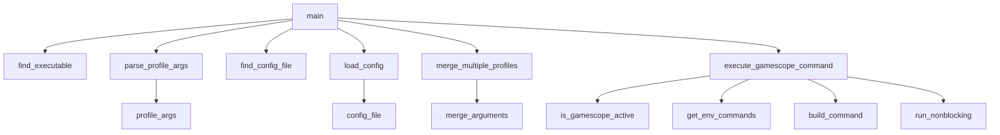
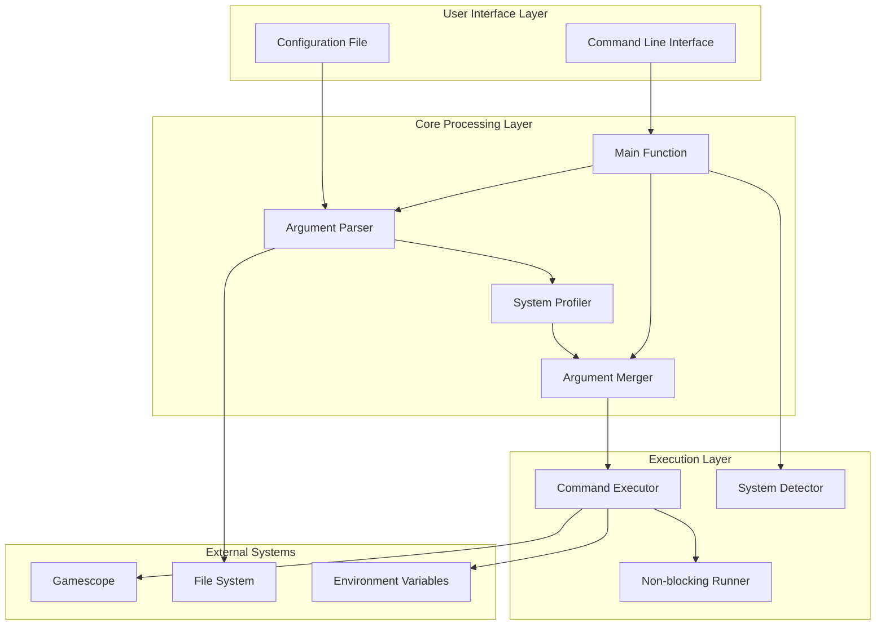
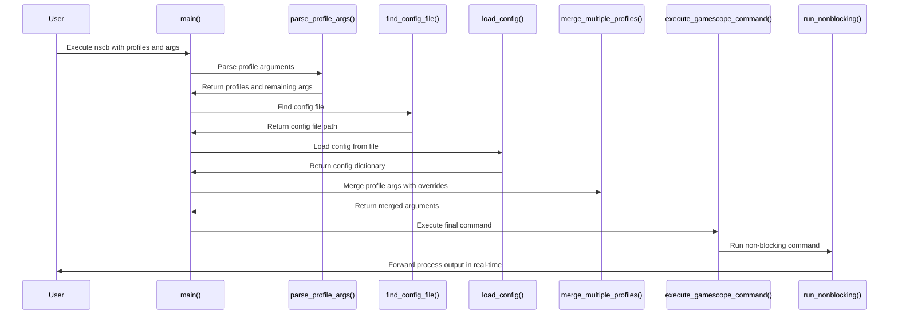

# NeoscopeBuddy (nscb) - Design Specification

## System Overview

NeoscopeBuddy (nscb.py) is a Python-based gamescope wrapper that provides a profile-based configuration system for managing gamescope settings. It enables users to define reusable gamescope configurations in a config file and apply them via command-line arguments with support for overrides.

### Core Purpose

- Provides a convenient wrapper around the gamescope compositor
- Enables profile-based configuration management
- Handles argument merging with precedence rules
- Supports environment hooks for pre/post command execution

## Architecture and Components

### Core Components



#### Main Entry Point (`main`)

- Orchestrates the entire workflow
- Validates dependencies (gamescope executable)
- Parses command-line arguments
- Loads and merges profile configurations
- Executes the final gamescope command

#### Configuration Management

- `find_config_file`: Locates config at `$XDG_CONFIG_HOME/nscb.conf` or `$HOME/.config/nscb.conf`
- `load_config`: Parses KEY=VALUE format with support for quoted values and comments

#### Argument Processing

- `parse_profile_args`: Parses profile specifications (`-p`, `--profile`, `--profiles=...`)
- `separate_flags_and_positionals`: Separates flags from positional arguments
- `split_at_separator`: Handles the `--` separator that separates gamescope args from app args

#### Profile System

- `merge_arguments`: Merges profile arguments with override arguments, implementing precedence rules
- `merge_multiple_profiles`: Handles merging of multiple profiles using reduce

#### Execution Engine

- `execute_gamescope_command`: Builds and executes the final command
- `run_nonblocking`: Handles non-blocking I/O with real-time output forwarding
- `is_gamescope_active`: Detects if already running under gamescope
- `get_env_commands`: Retrieves pre/post execution hooks from environment variables

### Configuration Format

- Config file uses `KEY=VALUE` format
- Keys represent profile names
- Values are space-separated gamescope arguments
- Supports quoted values and comments (lines starting with #)
- Example:

  ```
  gaming=-f -W 1920 -H 1080
  streaming=--borderless -W 1280 -H 720
  ```

## Configuration and Argument System

### Gamescope Arguments Mapping

```python
GAMESCOPE_ARGS_MAP = {
    "-W": "--output-width",
    "-H": "--output-height",
    "-w": "--nested-width",
    "-h": "--nested-height",
    "-b": "--borderless",
    "-C": "--hide-cursor-delay",
    "-e": "--steam",
    "-f": "--fullscreen",
    "-F": "--filter",
    "-g": "--grab",
    "-o": "--nested-unfocused-refresh",
    "-O": "--prefer-output",
    "-r": "--nested-refresh",
    "-R": "--ready-fd",
    "-s": "--mouse-sensitivity",
    "-T": "--stats-path",
    "--sharpness": "--fsr-sharpness",
}
```

### Argument Merging Logic

The system implements sophisticated argument merging with the following rules:

1. **Precedence**: Override arguments take precedence over profile arguments
2. **Conflict Resolution**: Mutually exclusive flags like `-f` (fullscreen) and `-b` (borderless) are handled properly
3. **Non-conflict Preservation**: Non-conflicting flags from profiles are preserved unless explicitly overridden
4. **Value Override**: When flags have values, new values override old ones
5. **Order Preservation**: The order of arguments is maintained in the final command

#### Conflict Handling Example

If a profile specifies `-f` (fullscreen) and an override specifies `--borderless`, the borderless flag wins and the fullscreen flag is removed from the final arguments.

## Command-Line Interface

### Usage Patterns

```
nscb.py -p fullscreen -- /bin/mygame                 # Single profile
nscb.py --profiles=profile1,profile2 -- /bin/mygame  # Multiple profiles
nscb.py -p profile1 -W 3140 -H 2160 -- /bin/mygame   # Profile with overrides
```

### Profile Specification Options

- `-p PROFILE` / `--profile=PROFILE`: Specify a single profile
- `--profiles=profile1,profile2,...`: Specify multiple profiles
- Command-line arguments after profile specifications override profile settings

### Separator Usage

- `--` separates gamescope arguments from application arguments
- Everything after `--` is passed to the application

## Environment Variables

### Pre/Post Command Hooks

- `NSCB_PRE_CMD` / `NSCB_PRECMD`: Command to run before gamescope/app execution
- `NSCB_POST_CMD` / `NSCB_POSTCMD`: Command to run after gamescope/app execution (new names take precedence over legacy names)

### System Detection

- `XDG_CURRENT_DESKTOP`: Used to detect if already running under gamescope

## System Architecture



## Data Flow Process

The application follows this data flow:

1. **Input Parsing**:
   - Command line arguments are parsed by `parse_profile_args`
   - Profile specifications are extracted and remaining args are preserved

2. **Configuration Loading**:
   - Config file is located using `find_config_file`
   - Profile arguments are loaded from config using `load_config`

3. **Argument Merging**:
   - Profile arguments and override arguments are merged using `merge_arguments`
   - Conflict resolution occurs during merging
   - Multiple profiles are merged using `merge_multiple_profiles`

4. **Execution Preparation**:
   - Gamescope active status is checked using `is_gamescope_active`
   - Environment commands are retrieved using `get_env_commands`
   - Final command is built using `build_command`

5. **Execution**:
   - Command is executed with non-blocking I/O using `run_nonblocking`
   - Output is forwarded in real-time

## Key Workflow



## Argument Merging Algorithm

The `merge_arguments` function implements the following logic:

1. **Separation**: Arguments are split at the `--` separator
2. **Classification**: Flags and positionals are separated using `separate_flags_and_positionals`
3. **Canonicalization**: Short form flags are converted to long form using `GAMESCOPE_ARGS_MAP`
4. **Conflict Identification**: Display mode flags (`-f`, `--fullscreen`, `-b`, `--borderless`) are identified as mutually exclusive
5. **Classification**: Flags are classified as conflict or non-conflict
6. **Resolution**: Override conflict flags take precedence over profile conflict flags
7. **Preservation**: Non-conflict profile flags are preserved unless overridden
8. **Assembly**: Final ordered argument list is assembled and flattened

## Development Guidelines

### Adding New Gamescope Arguments

- Add mappings to `GAMESCOPE_ARGS_MAP` for argument normalization
- Ensure new arguments work with argument separation logic
- Test with profile system and override functionality

### Security Considerations

- Uses `shlex.quote()` for command construction to prevent injection
- Validates executable paths before execution
- Sanitizes user input from config files

### Extension Points

- Can add new gamescope argument mappings to `GAMESCOPE_ARGS_MAP`
- The merging logic can accommodate new conflict patterns
- Environment hook system allows for pre/post execution customization
