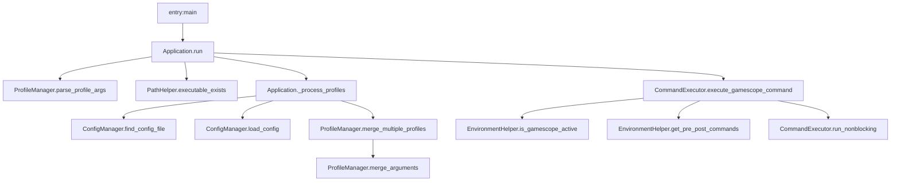
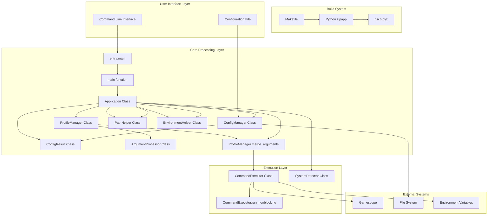
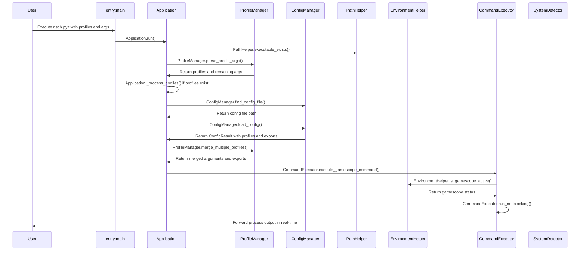

# NeoscopeBuddy (nscb) - Design Specification

## System Overview

NeoscopeBuddy (nscb.pyz) is a Python-based gamescope wrapper that provides a profile-based configuration system for managing gamescope settings. It enables users to define reusable gamescope configurations in a config file and apply them via command-line arguments with support for overrides. The application is packaged as a zipapp for easy distribution and execution.

### Core Purpose

- Provides a convenient wrapper around the gamescope compositor
- Enables profile-based configuration management
- Handles argument merging with precedence rules
- Supports environment hooks for pre/post command execution
- Provides help functionality via `--help` flag

## Architecture and Components

### Core Components



#### Main Entry Point (`entry:main`)

- Entry point for the application when packaged as zipapp
- Located in `src/entry.py`
- Calls the `main` function from `nscb.application`
- Handles global exception handling and returns appropriate exit codes

#### Application Main Function (`main`)

- Located in `src/nscb/application.py`
- Creates and runs the `Application` instance with command-line arguments
- Includes exception handling for `NscbError` and general exceptions
- Returns appropriate exit codes
- Handles debug logging when `NSCB_DEBUG` environment variable is set

#### Project Structure

The application follows a modular architecture with the following directory structure:

```
src/
├── entry.py          # Application entry point for zipapp packaging
├── nscb/
│   ├── __init__.py
│   ├── application.py    # Main application orchestrator
│   ├── profile_manager.py # Profile parsing and merging logic
│   ├── config_manager.py  # Configuration loading and parsing
│   ├── argument_processor.py # Argument parsing utilities
│   ├── command_executor.py  # Command building and execution
│   ├── system_detector.py   # System detection utilities
│   ├── path_helper.py       # Path operations
│   ├── environment_helper.py # Environment variable operations
│   ├── gamescope_args.py    # Gamescope argument mappings
│   ├── types.py             # Type definitions
│   └── exceptions.py        # Custom exception classes
```

#### Application (`Application`)

- Main orchestrator class that manages the entire workflow
- Coordinates all other components
- Handles dependency validation and execution flow
- `_process_profiles`: Processes profile configurations, loads config, merges profiles, and returns both arguments and exported environment variables
- `main`: Entry point function that creates Application instance and runs with command-line arguments, includes exception handling

#### Profile Manager (`ProfileManager`)

- `parse_profile_args`: Parses profile specifications (`-p`, `--profile`, `--profiles=...`)
- `merge_arguments`: Merges profile arguments with override arguments, implementing precedence rules
- `merge_multiple_profiles`: Handles merging of multiple profiles using reduce
- `_merge_flags`: Internal method to merge flags with conflict resolution
- `_canon`: Converts flags to canonical form using `GAMESCOPE_ARGS_MAP`
- `_flags_to_args_list`: Converts flag tuples to flat argument list
- `_build_app_command`: Internal helper that builds application command from arguments with proper quoting

#### Configuration Manager (`ConfigManager`)

- `find_config_file`: Locates config at `$XDG_CONFIG_HOME/nscb.conf` or `$HOME/.config/nscb.conf`
- `load_config`: Parses KEY=VALUE format for profiles and `export VAR_NAME=value` format for environment variables, with support for quoted values and comments
- Returns `ConfigResult` object containing both profiles and environment exports

#### Configuration Result (`ConfigResult`)

- Class that holds both profile configurations and environment exports
- Provides dictionary-style access to profiles
- Supports backward compatibility with dictionary operations
- Contains both `profiles` (profile configurations) and `exports` (environment variable exports)

#### Argument Processor (`ArgumentProcessor`)

- `split_at_separator`: Handles the `--` separator that separates gamescope args from app args
- `separate_flags_and_positionals`: Separates flags from positional arguments

#### Command Executor (`CommandExecutor`)

- `execute_gamescope_command`: Builds and executes the final command with proper handling for when gamescope is already active (bypasses gamescope wrapper when already in gamescope environment)
- `run_nonblocking`: Handles non-blocking I/O with real-time output forwarding using selectors for efficient I/O multiplexing
- `get_env_commands`: Retrieves pre/post execution hooks from environment variables
- `build_command`: Builds command string from parts with proper filtering, removing empty strings to avoid semicolon artifacts and joining with semicolons to execute multiple commands
- `_build_app_command`: Internal helper that quotes application arguments using shlex.quote to prevent command injection
- `_build_inactive_gamescope_command`: Builds command when gamescope is not active, handles LD_PRELOAD and environment variable exports appropriately
- `_build_active_gamescope_command`: Builds command when gamescope is already active, handles LD_PRELOAD and environment variable exports appropriately
- **LD_PRELOAD Handling**: When gamescope is not active, properly handles LD_PRELOAD by using `env -u LD_PRELOAD gamescope` to prevent gamescope from interfering with the application's LD_PRELOAD, and when the application is executed, preserves it for the application. When both exported environment variables and LD_PRELOAD are present, combines them into a single `env` command to avoid nested `env` commands (e.g., `env EXPORT1=value1 LD_PRELOAD="$LD_PRELOAD" <app with args>` instead of `env EXPORT1=value1 env LD_PRELOAD=... <app with args>`)

#### System Detector (`SystemDetector`)

- `find_executable`: Checks if executable exists in PATH using `PathHelper`
- `is_gamescope_active`: Detects if already running under gamescope by using `EnvironmentHelper`

#### Path Helper (`PathHelper`)

- `get_config_path`: Gets the path to the config file following XDG Base Directory specification
- `executable_exists`: Checks if an executable exists in PATH

#### Environment Helper (`EnvironmentHelper`)

- `get_pre_post_commands`: Gets pre/post commands from environment variables
- `is_gamescope_active`: Determines if system runs under gamescope by checking XDG_CURRENT_DESKTOP first, then falling back to process detection

### Configuration Format

- Config file uses `KEY=VALUE` format for profiles and `export VAR_NAME=value` format for environment variables
- Profile keys represent profile names, values are space-separated gamescope arguments
- Export keys represent environment variable names, values are the variable values
- Supports quoted values and comments (lines starting with #)
- Quoted values have their quotes stripped during parsing
- Empty lines and lines without equals signs are ignored
- Example:

  ```
  gaming=-f -W 1920 -H 1080
  streaming=--borderless -W 1280 -H 720
  # This is a comment
  portable="--fsr-sharpness 5 --framerate-limit 60"
  export DISPLAY=:0
  export MANGOHUD=1
  export CUSTOM_VAR="value with spaces"
  ```

## Configuration and Argument System

### Gamescope Arguments Mapping

```python
GAMESCOPE_ARGS_MAP = {
    "-W": "--output-width",
    "-H": "--output-height",
    "-w": "--nested-width",
    "-h": "--nested-height",
    "-b": "--borderless",
    "-C": "--hide-cursor-delay",
    "-e": "--steam",
    "-f": "--fullscreen",
    "-F": "--filter",
    "-g": "--grab",
    "-o": "--nested-unfocused-refresh",
    "-O": "--prefer-output",
    "-r": "--nested-refresh",
    "-R": "--ready-fd",
    "-s": "--mouse-sensitivity",
    "-T": "--stats-path",
    "--sharpness": "--fsr-sharpness",
}
```

This mapping is used to convert short form flags to long form for conflict resolution during argument merging.

### Argument Merging Logic

The system implements sophisticated argument merging with the following rules:

1. **Precedence**: Override arguments take precedence over profile arguments
2. **Conflict Resolution**: Mutually exclusive flags like `-f` (fullscreen) and `-b` (borderless) are handled properly
3. **Non-conflict Preservation**: Non-conflicting flags from profiles are preserved unless explicitly overridden
4. **Value Override**: When flags have values, new values override old ones
5. **Order Preservation**: The order of arguments is maintained in the final command

#### Conflict Handling Example

If a profile specifies `-f` (fullscreen) and an override specifies `--borderless`, the borderless flag wins and the fullscreen flag is removed from the final arguments.

## Command-Line Interface

### Usage Patterns

The application can be executed in multiple ways:

```
python3 -m nscb.pyz -p fullscreen -- /bin/mygame                 # Direct zipapp execution
python3 -m nscb.pyz --profiles=profile1,profile2 -- /bin/mygame  # Multiple profiles
python3 -m nscb.pyz -p profile1 -W 3140 -H 2160 -- /bin/mygame   # Profile with overrides

# After installation via Makefile:
nscb.pyz -p fullscreen -- /bin/mygame                 # Single profile
nscb.pyz --profiles=profile1,profile2 -- /bin/mygame  # Multiple profiles
nscb.pyz -p profile1 -W 3140 -H 2160 -- /bin/mygame   # Profile with overrides
```

### Profile Specification Options

- `-p PROFILE`: Specify a single profile
- `--profile=PROFILE`: Specify a single profile (equals format)
- `--profiles=profile1,profile2,...`: Specify multiple profiles (comma-separated)
- Command-line arguments after profile specifications override profile settings

### Help and Debug Options

- `--help`: Display usage information and exit
- `NSCB_DEBUG=1`: Enable debug logging to stderr when set to truthy value ("1", "true", "yes", "on")

### Separator Usage

- `--` separates gamescope arguments from application arguments
- Everything after `--` is passed to the application

## Environment Variables

### Pre/Post Command Hooks

- `NSCB_PRE_CMD` / `NSCB_PRECMD`: Command to run before gamescope/app execution
- `NSCB_POST_CMD` / `NSCB_POSTCMD`: Command to run after gamescope/app execution (new names take precedence over legacy names)

### LD_PRELOAD Handling

- `LD_PRELOAD`: When present, nscb.py properly handles this environment variable to prevent gamescope from interfering with the application's library loading
  - When LD_PRELOAD is set and gamescope is not active: `env -u LD_PRELOAD gamescope <flags> -- env LD_PRELOAD="$LD_PRELOAD" <executable with args>`
  - When LD_PRELOAD is not set and gamescope is not active: `gamescope <flags> -- <executable with args>` (no env wrappers needed)
  - When gamescope is already active: `env LD_PRELOAD="$LD_PRELOAD" <executable with args>` if LD_PRELOAD was originally set, otherwise `<executable with args>` (preserving original LD_PRELOAD for the application when present)
  - When both exported environment variables and LD_PRELOAD are present, they are combined into a single `env` command to avoid nested `env` commands

### LD_PRELOAD Override

- `NSCB_DISABLE_LD_PRELOAD_WRAP`: When set to a truthy value ("1", "true", "yes", "on"), this environment variable disables the LD_PRELOAD wrapping functionality, allowing the application to inherit the LD_PRELOAD environment variable without gamescope's intervention
  - When NSCB_DISABLE_LD_PRELOAD_WRAP is set to a truthy value, LD_PRELOAD is not stripped for gamescope or preserved for the application
  - This allows for direct control of LD_PRELOAD behavior in special circumstances where the default wrapping is undesirable
- `FAUGUS_LOG`: When this environment variable is set (indicating launch via faugus-launcher), LD_PRELOAD wrapping is automatically disabled without requiring the NSCB_DISABLE_LD_PRELOAD_WRAP override
  - When FAUGUS_LOG is present, LD_PRELOAD is not stripped for gamescope or preserved for the application
  - This provides automatic compatibility with faugus-launcher without user intervention

### System Detection

- `XDG_CURRENT_DESKTOP`: Used to detect if already running under gamescope

## Build System and Distribution

The application uses a Makefile-based build system that packages the application as a zipapp for easy distribution:

### Build Targets

- `make build`: Creates the zipapp package (`dist/nscb.pyz`) using Python's zipapp module
- `make install`: Installs the zipapp to `~/.local/bin` with a convenient symlink as `nscb`
- `make clean`: Removes build artifacts and temporary files
- `make all`: Runs clean, build, and install in sequence
- `make test`: Runs the test suite using uv and pytest
- `make quality`: Runs code quality checks (ruff and pyright)

### Packaging Approach

The application uses Python's zipapp module to create a single executable file from the modular source code:

1. Source code from `src/nscb/` is copied to a staging directory
2. Entry point file `src/entry.py` is added to the staging directory
3. Zipapp creates a single executable file `dist/nscb.pyz` with the entry point `entry:main`
4. The resulting file can be executed directly with Python: `python3 nscb.pyz`

## System Architecture



## Data Flow Process

The application follows this data flow:

1. **Input Parsing**:
   - Command line arguments are parsed by the `main` function which calls `Application.run`
   - Profile specifications are extracted using `ProfileManager.parse_profile_args`
   - Profile specifications are extracted and remaining args are preserved

2. **Profile Processing**:
   - If profiles are specified, `Application._process_profiles` handles profile loading and processing
   - Config file is located using `ConfigManager.find_config_file`
   - Profile arguments and exported environment variables are loaded from config using `ConfigManager.load_config`
   - Multiple profiles are merged using `ProfileManager.merge_multiple_profiles` with `shlex.split` to properly parse profile arguments
   - Returns both final arguments and environment exports

3. **Execution Preparation**:
   - Gamescope active status is checked using `SystemDetector.is_gamescope_active`
   - Environment commands are retrieved using `CommandExecutor.get_env_commands`
   - LD_PRELOAD environment variable and disable flags are checked to preserve it for the application when appropriate
   - Exported environment variables from config are applied to the execution environment
   - Final command is built using `CommandExecutor._build_inactive_gamescope_command` or `CommandExecutor._build_active_gamescope_command` depending on active status
   - Command is assembled using `CommandExecutor.build_command` with pre/post commands

4. **Execution**:
   - Command is executed with non-blocking I/O using `CommandExecutor.run_nonblocking`
   - Output is forwarded in real-time

## Key Workflow



## Argument Merging Algorithm

The `ProfileManager.merge_arguments` function implements the following logic:

1. **Separation**: Arguments are split at the `--` separator using `ArgumentProcessor.split_at_separator`
2. **Classification**: Flags and positionals are separated using `ArgumentProcessor.separate_flags_and_positionals`
3. **Canonicalization**: Short form flags are converted to long form using `GAMESCOPE_ARGS_MAP`
4. **Conflict Identification**: Display mode flags (`-f`, `--fullscreen`, `-b`, `--borderless`) are identified as mutually exclusive
5. **Classification**: Flags are classified as conflict or non-conflict
6. **Resolution**: Override conflict flags take precedence over profile conflict flags
7. **Preservation**: Non-conflict profile flags are preserved unless overridden
8. **Assembly**: Final ordered argument list is assembled and flattened

The algorithm handles argument separation by:

- Splitting arguments into before and after the `--` separator (which separates gamescope args from app args)
- Processing flags and their potential values as tuples (flag, value)
- Preserving positional arguments in their original order
- Maintaining proper argument ordering in the final output

## Development Guidelines

### Adding New Gamescope Arguments

- Add mappings to `GAMESCOPE_ARGS_MAP` for argument normalization
- Ensure new arguments work with argument separation logic
- Test with profile system and override functionality

### Type Aliases

The codebase defines the following type aliases for better readability:

- `ArgsList = list[str]`: List of string arguments
- `FlagTuple = tuple[str, str | None]`: Tuple representing a flag and its optional value
- `ProfileArgs = dict[str, str]`: Dictionary mapping profile names to arguments
- `ConfigData = dict[str, str]`: Dictionary representing configuration data
- `EnvExports = dict[str, str]`: Dictionary mapping environment variable names to values
- `ExitCode = int`: Integer representing exit codes
- `ProfileArgsList = list[ArgsList]`: List of argument lists for multiple profiles
- `ConfigResult`: Class that holds both profiles and exported environment variables

### Security Considerations

- Uses `shlex.quote()` for command construction to prevent injection
- Properly handles LD_PRELOAD to prevent gamescope from interfering with application's library loading
- When LD_PRELOAD is present, uses `env -u LD_PRELOAD` for gamescope and preserves it for the application using `env LD_PRELOAD="$LD_PRELOAD"`
- When both exported environment variables and LD_PRELOAD are present, combines them into a single `env` command to avoid nested `env` commands
- When LD_PRELOAD is not present, skips the env wrappers for efficiency and cleaner command output
- Validates executable paths before execution using `PathHelper`
- Sanitizes user input from config files
- Implements proper exception handling with custom exception classes:
  - `NscbError`: Base exception for nscb errors
  - `ConfigNotFoundError`: Raised when config file cannot be found
  - `ProfileNotFoundError`: Raised when a specified profile is not found in config

### Testing Approach

The application follows a comprehensive testing strategy with multiple levels:

#### Unit Tests (`tests/test_*.py`)

- Focus on individual function behavior in specific test modules (e.g., `test_profile_manager.py`, `test_config_manager.py`)
- Test core utilities like argument parsing, configuration loading, and argument merging
- Use mocking extensively to isolate functionality with `pytest-mock`
- Validate edge cases and error conditions for each component
- Marked with `@pytest.mark.unit` decorator

#### Integration Tests (`tests/test_*.py`)

- Test component interactions and workflows across modules
- Cover complete scenarios including config loading, profile merging, and command execution
- Validate environment variable handling and command building with real module integration
- Test error handling in execution paths
- Marked with `@pytest.mark.integration` decorator

#### End-to-End Tests (`tests/test_*.py`)

- Simulate real user workflows from command parsing to execution
- Test complete profile execution with temporary config files
- Validate override functionality and separator handling with real execution paths
- Cover error conditions in execution environments
- Marked with `@pytest.mark.e2e` decorator

#### Test Infrastructure (`tests/conftest.py`)

- Provides common fixtures for mocking system components with proper import paths
- Defines reusable fixtures for temporary config files and mock setup
- Offers parameterized testing fixtures for complex scenarios
- Includes utilities for consistent mocking across test modules

#### Testing Categories

The test suite covers these key areas with 284+ tests:

1. **Profile System**: Testing argument merging, conflict resolution, and multiple profile scenarios
2. **Configuration Management**: Loading, parsing, and handling of various config file formats including exports
3. **Argument Processing**: Parsing, separation, canonicalization, and precedence rules
4. **Execution Flow**: Command building, environment variable handling, LD_PRELOAD management, and subprocess execution
5. **Error Handling**: Missing executables, configuration files, profiles, and exception propagation
6. **System Detection**: Gamescope active state detection and environment variable checks
7. **Command Building**: Proper handling of gamescope args vs app args, pre/post commands, and environment exports
8. **Environment Handling**: LD_PRELOAD wrapping, environment variable exports, and hook execution

#### Testing Practices and Patterns

- Uses `pytest-mock` (mocker fixture) for dependency isolation with correct module import paths
- Implements both parameterized and scenario-based testing approaches
- Follows AAA (Arrange-Act-Assert) pattern for test structure
- Uses temporary files for realistic configuration testing
- Properly mocks system calls, environment variables, and command execution for consistent runs
- Includes substring-safe assertions (e.g., using regex to check for flags like `-f` vs substring in `--framerate-limit=120`)
- Handles exception propagation and error code returns in application workflows

#### Test Module Structure

- `tests/test_application.py`: Main application orchestrator and workflow tests
- `tests/test_profile_manager.py`: Profile parsing, merging, and conflict resolution tests
- `tests/test_config_manager.py`: Configuration loading, parsing, and ConfigResult tests
- `tests/test_command_executor.py`: Command building and execution tests
- `tests/test_argument_processor.py`: Argument parsing and separator handling tests
- `tests/test_environment_helper.py`: Environment variable and gamescope detection tests
- `tests/test_system_detector.py`: Executable detection and system state tests
- `tests/test_gamescope_args.py`: Gamescope argument mappings and conflict tests
- `tests/test_config_result.py`: Configuration result object behavior tests
- `tests/test_types.py`: Type definitions and usage in real scenarios tests
- `tests/test_exceptions.py`: Exception handling and propagation tests

#### Testing Quality Assurance

- All tests use proper mocking to prevent accidental execution of gamescope during testing
- Exception handling is tested at both unit and application levels
- Command building is validated to ensure proper argument precedence and conflict resolution
- Environment variable handling is tested with and without LD_PRELOAD scenarios
- Test coverage includes edge cases like missing configurations, invalid arguments, and system detection failure

### Extension Points

- Can add new gamescope argument mappings to `GAMESCOPE_ARGS_MAP`
- The merging logic can accommodate new conflict patterns
- Environment hook system allows for pre/post execution customization
- Testing framework supports new test categories and scenarios
- All major functionality is encapsulated in classes making it easy to extend:
  - `Application` for main orchestration
  - `ProfileManager` for profile-related functionality
  - `ConfigManager` for configuration handling
  - `ArgumentProcessor` for argument manipulation
  - `CommandExecutor` for command execution
  - `SystemDetector` for system detection
  - `PathHelper` for path-related utilities
  - `EnvironmentHelper` for environment-related utilities
