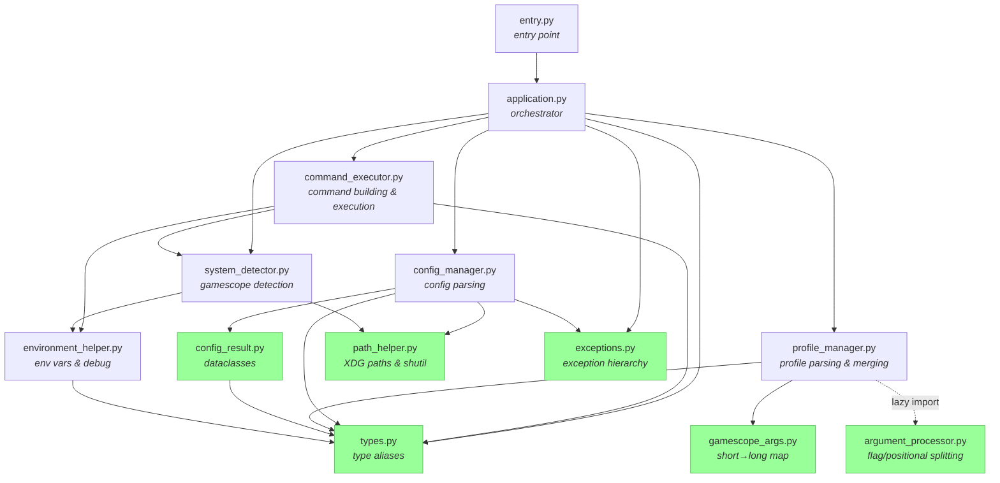
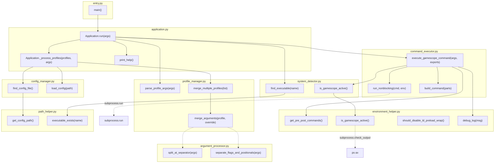
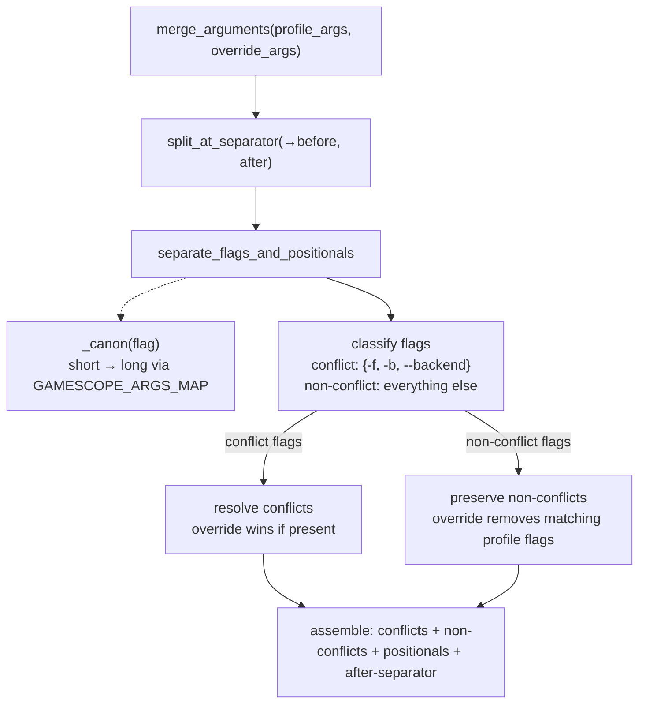
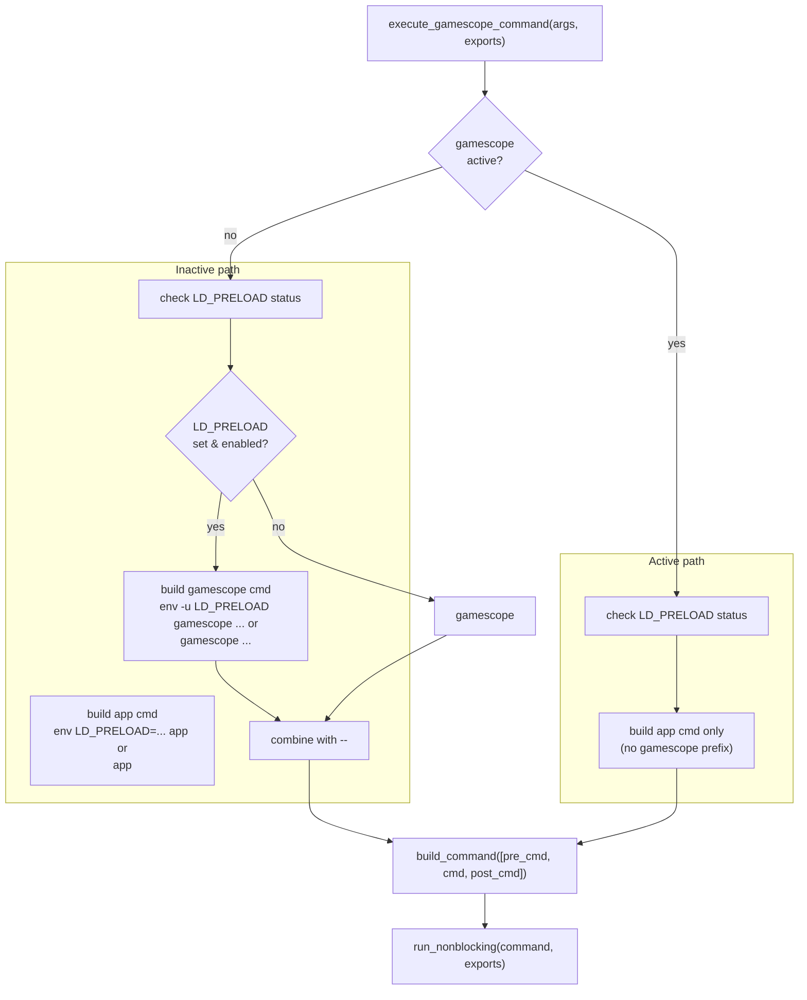
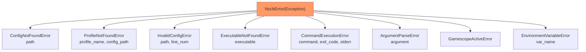

# NeoscopeBuddy (nscb) — Design Specification

## System Overview

NeoscopeBuddy (nscb.pyz) is a gamescope wrapper with profile-based configuration. Users define reusable gamescope settings in a config file and apply them via CLI with override support. Packaged as a deterministic zipapp.

## Module Dependency Map

This graph shows every import relationship between source files. **Leaf nodes** (green) have no project dependencies.


```mermaid
graph TD
    entry["entry.py<br/><i>entry point</i>"]
    application["application.py<br/><i>orchestrator</i>"]
    command_executor["command_executor.py<br/><i>command building &amp; execution</i>"]
    config_manager["config_manager.py<br/><i>config parsing</i>"]
    config_result["config_result.py<br/><i>dataclasses</i>"]
    profile_manager["profile_manager.py<br/><i>profile parsing &amp; merging</i>"]
    argument_processor["argument_processor.py<br/><i>flag/positional splitting</i>"]
    system_detector["system_detector.py<br/><i>gamescope detection</i>"]
    environment_helper["environment_helper.py<br/><i>env vars &amp; debug</i>"]
    path_helper["path_helper.py<br/><i>XDG paths &amp; shutil</i>"]
    gamescope_args["gamescope_args.py<br/><i>short→long map</i>"]
    types["types.py<br/><i>type aliases</i>"]
    exceptions["exceptions.py<br/><i>exception hierarchy</i>"]

    entry --> application
    application --> command_executor
    application --> config_manager
    application --> profile_manager
    application --> system_detector
    application --> exceptions
    application --> types

    command_executor --> environment_helper
    command_executor --> system_detector
    command_executor --> types

    config_manager --> config_result
    config_manager --> path_helper
    config_manager --> exceptions
    config_manager --> types

    profile_manager --> gamescope_args
    profile_manager --> types
    profile_manager -. "lazy import" .-> argument_processor

    system_detector --> environment_helper
    system_detector --> path_helper

    config_result --> types
    environment_helper --> types

    style types fill:#9f9,stroke:#6b6
    style exceptions fill:#9f9,stroke:#6b6
    style path_helper fill:#9f9,stroke:#6b6
    style gamescope_args fill:#9f9,stroke:#6b6
    style argument_processor fill:#9f9,stroke:#6b6
    style config_result fill:#9f9,stroke:#6b6
```

### Module Responsibilities

| Module                  | Role                                                            | Key exports                                 |
| ----------------------- | --------------------------------------------------------------- | ------------------------------------------- |
| `entry.py`              | Zipapp entry point, calls `main()`                              | `main()`                                    |
| `application.py`        | Orchestrator: parse args → load config → merge → execute        | `Application`, `print_help()`, `main()`     |
| `profile_manager.py`    | Profile arg parsing, flag merging with conflict resolution      | `ProfileManager`                            |
| `config_manager.py`     | XDG-aware config loading, section + flat format, validation     | `ConfigManager`                             |
| `config_result.py`      | Dataclasses for config output                                   | `ConfigResult`, `ProfileEntry`              |
| `argument_processor.py` | `--` separator splitting, flag vs positional classification     | `ArgumentProcessor`                         |
| `command_executor.py`   | Command assembly, LD_PRELOAD handling, subprocess execution     | `CommandExecutor`                           |
| `system_detector.py`    | Thin pass-through to EnvironmentHelper + PathHelper (mock seam) | `SystemDetector`                            |
| `environment_helper.py` | `NSCB_*` env vars, gamescope detection, debug logging           | `EnvironmentHelper`, `debug_log()`          |
| `path_helper.py`        | XDG config path resolution, `shutil.which` wrapper              | `PathHelper`                                |
| `gamescope_args.py`     | Short-to-long flag mapping for conflict canonicalization        | `GAMESCOPE_ARGS_MAP`                        |
| `types.py`              | Shared type aliases                                             | `ArgsList`, `FlagTuple`, `EnvExports`, etc. |
| `exceptions.py`         | Exception hierarchy with structured attributes                  | `NscbError` and 8 subclasses                |

## Runtime Call Graph

This is the function-level call graph. Dashed edges are lazy/conditional calls.


```mermaid
graph TD
    subgraph "entry.py"
        A["main()"]
    end

    subgraph "application.py"
        B["Application.run(args)"]
        C["Application._process_profiles(profiles, args)"]
        D["print_help()"]
    end

    subgraph "profile_manager.py"
        E["parse_profile_args(args)"]
        F["merge_multiple_profiles(list)"]
        G["merge_arguments(profile, override)"]
    end

    subgraph "argument_processor.py"
        H["split_at_separator(args)"]
        I["separate_flags_and_positionals(args)"]
    end

    subgraph "config_manager.py"
        J["find_config_file()"]
        K["load_config(path)"]
    end

    subgraph "command_executor.py"
        L["execute_gamescope_command(args, exports)"]
        M["run_nonblocking(cmd, env)"]
        N["build_command(parts)"]
    end

    subgraph "system_detector.py"
        O["find_executable(name)"]
        P["is_gamescope_active()"]
    end

    subgraph "environment_helper.py"
        Q["get_pre_post_commands()"]
        R["is_gamescope_active()"]
        S["should_disable_ld_preload_wrap()"]
        T["debug_log(msg)"]
    end

    subgraph "path_helper.py"
        U["get_config_path()"]
        V["executable_exists(name)"]
    end

    A --> B
    B --> D
    B --> O
    B --> E
    B --> C
    B --> L

    C --> J
    C --> K
    C --> F

    F --> G
    G -.-> H
    G -.-> I

    L --> Q
    L --> P
    L --> N
    L --> M
    L --> T

    J --> U
    O --> V
    P --> R

    M -. "subprocess.run" .-> M2["subprocess.run"]
    R -. "subprocess.check_output" .-> R2["ps ax"]
```

## Data Flow Map

Shows how data transforms from CLI input to executed command.


```mermaid
graph LR
    subgraph "Input"
        CLI["sys.argv[1:]"]
    end

    subgraph "Parse"
        PA["parse_profile_args"]
        RES["remaining args"]
        PROFS["profile names"]
    end

    subgraph "Config"
        CF["find_config_file"]
        LC["load_config"]
        CR["ConfigResult<br/>{profiles, exports}"]
    end

    subgraph "Merge"
        MM["merge_multiple_profiles"]
        MA["merge_arguments"]
        FINAL["final args list"]
    end

    subgraph "Execute"
        EG["execute_gamescope_command"]
        BC["build_command"]
        CMD["shell command string"]
        RN["run_nonblocking"]
        RC["exit code"]
    end

    CLI --> PA
    PA --> PROFS
    PA --> RES
    PROFS --> CF
    CF --> LC
    LC --> CR
    CR -->|"profile.args"| MM
    RES --> MM
    MM --> MA
    MA --> FINAL
    FINAL --> EG
    EG --> BC
    BC --> CMD
    CMD --> RN
    RN --> RC
```

## Argument Merging Flow

The `merge_arguments` algorithm visualized:


```mermaid
graph TD
    IN["merge_arguments(profile_args, override_args)"]

    S1["split_at_separator(→before, after)"]
    S2["separate_flags_and_positionals"]

    CANON["_canon(flag)<br/>short → long via GAMESCOPE_ARGS_MAP"]

    CLASSIFY["classify flags<br/>conflict: {-f, -b, --backend}<br/>non-conflict: everything else"]

    RESOLVE["resolve conflicts<br/>override wins if present"]
    PRESERVE["preserve non-conflicts<br/>override removes matching profile flags"]

    ASSEMBLE["assemble: conflicts + non-conflicts + positionals + after-separator"]

    IN --> S1 --> S2 --> CLASSIFY
    CLASSIFY -->|"conflict flags"| RESOLVE
    CLASSIFY -->|"non-conflict flags"| PRESERVE
    RESOLVE --> ASSEMBLE
    PRESERVE --> ASSEMBLE
    S2 -.-> CANON
```

## Command Building Flow

How `execute_gamescope_command` assembles the final shell command:


```mermaid
graph TD
    START["execute_gamescope_command(args, exports)"]

    ACTIVE{gamescope<br/>active?}

    subgraph "Inactive path"
        IA["check LD_PRELOAD status"]
        HAS_PRELOAD{LD_PRELOAD<br/>set &amp; enabled?}
        GS_CMD["build gamescope cmd<br/>env -u LD_PRELOAD gamescope ... or<br/>gamescope ..."]
        APP_CMD["build app cmd<br/>env LD_PRELOAD=... app or<br/>app"]
        JOIN_I["combine with --"]
    end

    subgraph "Active path"
        AA["check LD_PRELOAD status"]
        AAPP_CMD["build app cmd only<br/>(no gamescope prefix)"]
    end

    FINAL["build_command([pre_cmd, cmd, post_cmd])"]
    EXEC["run_nonblocking(command, exports)"]

    START --> ACTIVE
    ACTIVE -->|"no"| IA
    IA --> HAS_PRELOAD
    HAS_PRELOAD -->|"yes"| GS_CMD
    HAS_PRELOAD -->|"no"| GS_CMD2["gamescope <args>"]
    GS_CMD --> JOIN_I
    GS_CMD2 --> JOIN_I
    JOIN_I --> FINAL

    ACTIVE -->|"yes"| AA
    AA --> AAPP_CMD
    AAPP_CMD --> FINAL

    FINAL --> EXEC
```

## Project Structure

```
src/
├── entry.py              # Zipapp entry point
└── nscb/
    ├── application.py    # Orchestrator
    ├── profile_manager.py # Profile parsing & merging
    ├── config_manager.py  # Config loading & validation
    ├── config_result.py   # ConfigResult, ProfileEntry dataclasses
    ├── argument_processor.py # -- separator & flag/positional splitting
    ├── command_executor.py  # Command building & subprocess execution
    ├── system_detector.py   # Gamescope detection (mock seam)
    ├── path_helper.py       # XDG paths, shutil.which
    ├── environment_helper.py # NSCB_* env vars, debug_log
    ├── gamescope_args.py    # GAMESCOPE_ARGS_MAP
    ├── types.py             # Type aliases
    └── exceptions.py        # NscbError hierarchy
```

## Configuration Format

Config at `$XDG_CONFIG_HOME/nscb.conf` or `~/.config/nscb.conf`.

```ini
# Section-based (preferred)
[gaming]
-f -W 1920 -H 1080
export MANGOHUD=1

[quiet]
-b

# Global exports (before any section) always apply
export DISPLAY=:0

# Legacy flat syntax still works
gaming=-f -W 1920 -H 1080
```

- Lines starting with `#` are comments
- Quoted values have quotes stripped
- Reserved profile names: `help`, `export`
- File >10MB or line >10KB → `InvalidConfigError`
- Invalid env var names → `InvalidConfigError` (reserved: `PATH`, `HOME`, `USER`, `SHELL`, `LD*PRELOAD`, `NSCB*`)

## Environment Variables

| Variable                         | Purpose                           |
| -------------------------------- | --------------------------------- |
| `NSCB_PRE_CMD` / `NSCB_PRECMD`   | Pre-execution hook                |
| `NSCB_POST_CMD` / `NSCB_POSTCMD` | Post-execution hook               |
| `NSCB_DEBUG=1`                   | Debug logging to stderr           |
| `NSCB_DISABLE_LD_PRELOAD_WRAP=1` | Disable LD_PRELOAD preservation   |
| `FAUGUS_LOG`                     | Auto-disables LD_PRELOAD wrapping |
| `XDG_CURRENT_DESKTOP`            | Gamescope detection               |

## Exception Hierarchy


```mermaid
graph TD
    NscbError["NscbError(Exception)"]
    ConfigNotFound["ConfigNotFoundError<br/>path"]
    ProfileNotFound["ProfileNotFoundError<br/>profile_name, config_path"]
    InvalidConfig["InvalidConfigError<br/>path, line_num"]
    ExecutableNotFound["ExecutableNotFoundError<br/>executable"]
    CommandExecution["CommandExecutionError<br/>command, exit_code, stderr"]
    ArgumentParse["ArgumentParseError<br/>argument"]
    GamescopeActive["GamescopeActiveError"]
    EnvVar["EnvironmentVariableError<br/>var_name"]

    NscbError --> ConfigNotFound
    NscbError --> ProfileNotFound
    NscbError --> InvalidConfig
    NscbError --> ExecutableNotFound
    NscbError --> CommandExecution
    NscbError --> ArgumentParse
    NscbError --> GamescopeActive
    NscbError --> EnvVar

    style NscbError fill:#f96,stroke:#c66
```

## Type Aliases

| Alias             | Definition                         | Used by                                       |
| ----------------- | ---------------------------------- | --------------------------------------------- |
| `ArgsList`        | `List[str]`                        | everywhere                                    |
| `FlagTuple`       | `Tuple[str, Optional[str]]`        | profile_manager, argument_processor           |
| `EnvExports`      | `Dict[str, str]`                   | application, config_manager, command_executor |
| `ExitCode`        | `int`                              | application, command_executor                 |
| `ProfileArgsList` | `List[ArgsList]`                   | profile_manager                               |
| `CommandTuple`    | `Tuple[str, str]`                  | command_executor, environment_helper          |
| `SplitResult`     | `Tuple[ArgsList, ArgsList]`        | argument_processor                            |
| `SeparatedArgs`   | `Tuple[List[FlagTuple], ArgsList]` | argument_processor                            |

## Build System

```makefile
make build        # deterministic zipapp → dist/nscb.pyz
make build-nix    # reproducible Nix build
make install      # ~/.local/bin/nscb.pyz + nscb symlink
make test         # pytest with coverage
make lint         # ty + pyright + ruff
make ci           # configure → test → lint → build
make ci-nix       # lint → test → build-nix
```

Build process: copy `src/` → inject version via `sed` → normalize timestamps (`SOURCE_DATE_EPOCH=1`) → deterministic zip (`LC_ALL=C sort`) → prepend shebang.

## Testing

See [tests/TEST_DESIGN.md](tests/TEST_DESIGN.md) for test infrastructure, fixture map, and coverage graph.
