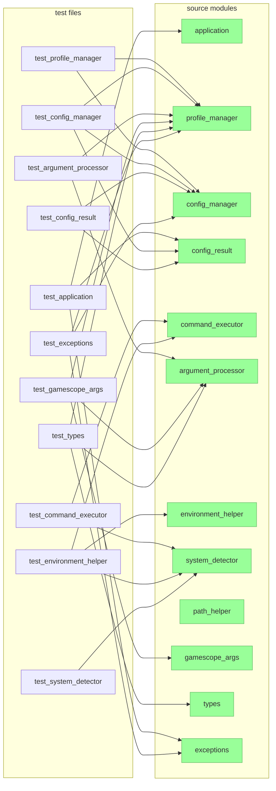
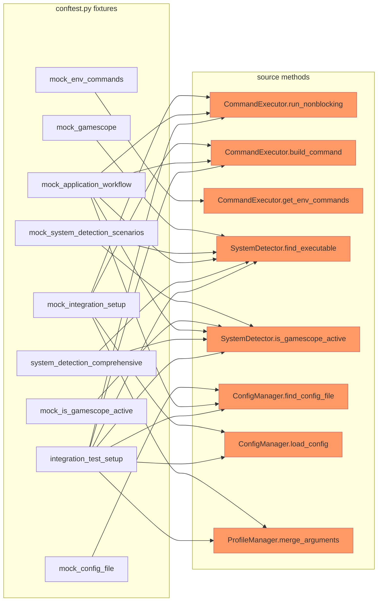
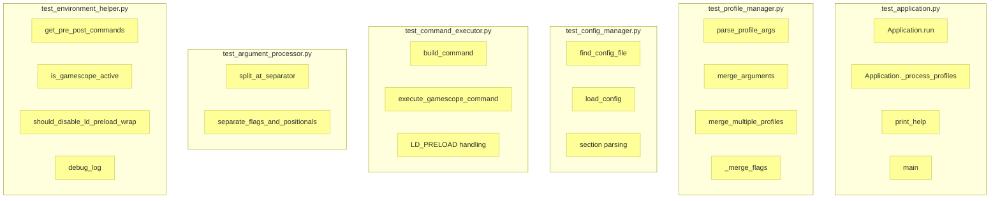

# NeoscopeBuddy — Test Design

## Test-to-Source Coverage Map

Every test file and which source modules it exercises. Green nodes are source modules; orange are test files.

### Source Module Test Coverage

| Source Module | Tested by |
|---|---|
| `application.py` | test_application, test_types, test_path_helper, test_config_manager, test_config_result, test_exceptions, test_system_detector, test_environment_helper, test_gamescope_args, test_argument_processor |
| `profile_manager.py` | test_profile_manager, test_types, test_config_manager, test_exceptions, test_gamescope_args, test_argument_processor |
| `config_manager.py` | test_config_manager, test_config_result, test_path_helper, test_exceptions |
| `command_executor.py` | test_command_executor, test_environment_helper |
| `argument_processor.py` | test_argument_processor, test_types, test_gamescope_args |
| `environment_helper.py` | test_environment_helper |
| `system_detector.py` | test_system_detector, test_command_executor, test_environment_helper, test_path_helper |
| `config_result.py` | test_config_result, test_application |
| `path_helper.py` | test_path_helper |
| `gamescope_args.py` | test_gamescope_args |
| `types.py` | test_types |
| `exceptions.py` | test_exceptions |

## Fixture Mock Target Map

Which conftest.py fixtures patch which source methods. This shows the mock boundary between tests and production code.

### Fixture Quick Reference

| Fixture | Type | Mock targets |
|---|---|---|
| `mock_system_exit` | patch | `sys.exit` |
| `mock_integration_setup` | dict | `run_nonblocking`, `build_command`, `print`, `merge_arguments`, `load_config` |
| `temp_config_file` | tempdir | none |
| `temp_config_with_content` | factory | none |
| `mock_gamescope` | patch | `find_executable` → True |
| `mock_config_file` | factory | `find_config_file` |
| `mock_system_detection_scenarios` | dict | `is_gamescope_active`, `find_executable` |
| `mock_is_gamescope_active` | patch | `is_gamescope_active` |
| `mock_env_commands` | factory | `get_env_commands` |
| `mock_ld_preload_scenarios` | monkeypatch | `LD_PRELOAD`, `NSCB_DISABLE_LD_PRELOAD_WRAP`, `FAUGUS_LOG` |
| `mock_application_workflow` | class | `find_executable`, `is_gamescope_active`, `run_nonblocking`, `build_command`, `find_config_file` |
| `xdg_config_scenarios` | monkeypatch | `XDG_CONFIG_HOME`, `HOME` |
| `system_detection_comprehensive` | class | `is_gamescope_active`, `find_executable` |
| `integration_test_setup` | class | `find_config_file`, `load_config`, `is_gamescope_active`, `find_executable`, `run_nonblocking`, `build_command`, `merge_arguments` |

Data-only fixtures (no mocking): `mock_execution_scenarios`, `mock_environment_variables`, `complex_args_scenario`, `profile_scenarios`, `config_scenarios`, `error_simulation`, `test_config_content`, `argument_processing_patterns`, `error_simulation_comprehensive`, `profile_test_scenarios`.

## Test Module → Source Method Map

What each test file actually tests at the method level.

## Test Strategy

- **`@pytest.mark.unit`** — isolated function behavior, heavy mocking
- **`@pytest.mark.integration`** — cross-module workflows with mocked I/O
- **`@pytest.mark.e2e`** — full application flow from args to execution

Run: `make test` (`uv run pytest --tb=short --cov=src --cov-report=term-missing --cov-branch`).

## Testing Patterns

- **AAA**: Arrange → Act → Assert
- **Mock paths**: always at class method level (e.g., `nscb.command_executor.CommandExecutor.run_nonblocking`)
- **Temp files**: `tempfile.mkdtemp()` for realistic config I/O
- **Parameterized**: conflict resolution, config parsing, error scenarios
- **Substring-safe**: regex assertions prevent `-f` matching `--framerate-limit`
